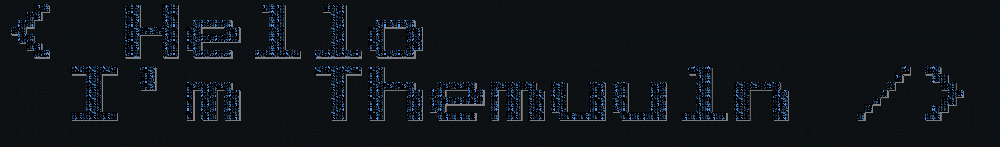

  

### 
 <h1> Hey  I'm Themuuln, A passionate ... developer from Nowhere.</h1>

### 
</a>

- 🌱 I’m currently learning **TS, React, NextJS**

- 👨‍💻 All of my projects are available at [https://github.com/themuuln?tab=repositories](https://github.com/themuuln?tab=repositories)

- 💬 Ask me about **Anything**

- ⚡ Fun fact **Most "FUN FACTS" use "FUN" pretty liberally**

- Repositories in Private Sorry

<h3 align="left">Connect with me:</h3>

<h3 align="left">Languages and Tools:</h3>

                 

  

   

## 🏆 GitHub Trophies

---

  
<!--START_SECTION:waka-->
<!--END_SECTION:waka-->

